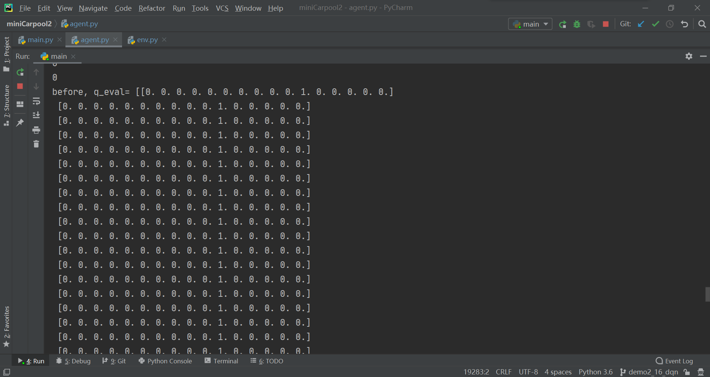

## DQN的demo

用简单的环境来测试DQN的流程，看看神经网络是否正确。

使用了两种环境：demo1和demo2。demo1是一条路径的，只有向左向右；demo2的环境复杂一点，有一个分叉路口。demo1的神经网络能跑通，，demo2就一直都没效果。

- **demo1_6_dqn**

  成功运行，到后面神经网络能知道出租车直接从0走到6点，神经网络已经学会了环境。

  

  

  

  

- **demo1_8_dqn**

  这个相比第一个而言有个折返的过程，需要先到8号地点获得第一个奖励，然后到3号地点获得第二个奖励，这个回合才算结束。训练到后期神经网络也基本学会了这个。能够达到一个还不错的效果。

  

  
  

- **demo2_16_dqn**

  环境相比demo1有个变化，多了一个分叉路口。环境的信息由connect.csv中的表确定。比如第i行第j列为1，表明i号地点和j号地点连通，为0则表示他们不连通。在11号地点有第一个奖励，在15号地点有第二个奖励。到达了15号地点则本轮结束。

  训练了很久但发现神经网络总时最后选择动作在0号地点和1号地点，打印神经网络的输出也发现，输出不对。

  
  
  
  
  

- **demo2_16_ddqn**

  环境同demo2_16_dqn，只是将神经网络部分修改了一下，用了函数式写法来搭建神经网络，并且更新使用ddqn的更新策略。但是这么做的效果和demo2_16_dqn的效果也是差不多的，神经网络没有学会什么东西。

  
  
  

